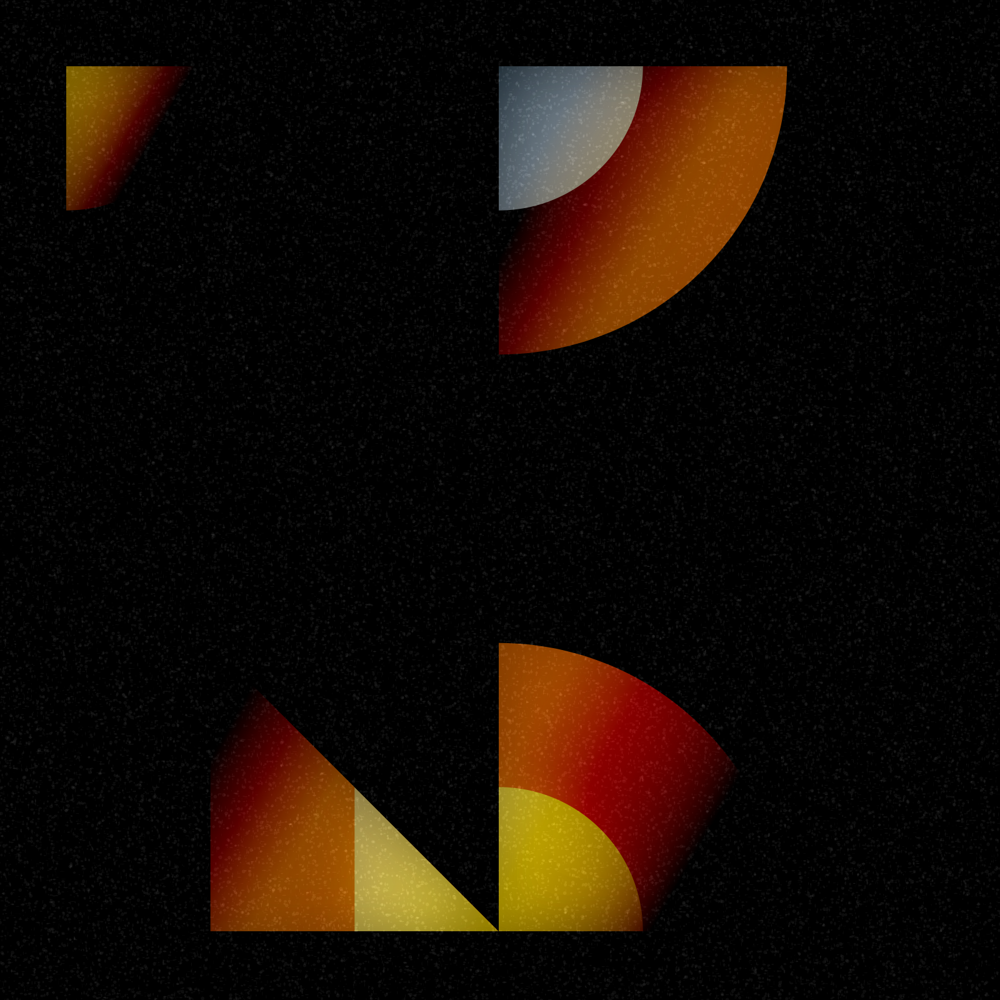

# week8
This is an analysis made for the subsequent creation of a new artwork

# Part1: Imaging Technique inspiration


[Artwork Link](https://openprocessing.org/sketch/1247971)

## Inspiration introduction

- This artwork uses different geometric shapes such as circles, rectangles and trapezoids to create an artistic effect through overlapping and shadows. However, if you click on the link and refresh, you will realise that it is a dynamic and **interactive digital artwork**, with a new design appearing with each refresh. 
- For a subsequent group assignment, I considered adding this type of interaction to our work. That is, a brand new piece appears each time you click., At the same time, this design could make our project more **interactive** by clicking through, thus increasing the user's **attraction** to the artwork.

## Example display



# Part2:Coding Technique Exploration

## Code display

 Use the `random()` function to generate random positions, sizes and colors

#### Example [random()](https://p5js.org/reference/#/p5/random)
```
  let x = random();
  let y = random();
  ```


Use `setup()`function to set the canvas size and other parameters that only need to be set once.

#### Example [setup()](https://p5js.org/reference/#/p5/setup)
```
function setup() {
    createCanvas( );
    background();
}
```


Use the `draw()` function to execute code to achieve animation effects continuously.
#### Example [draw()](https://p5js.org/reference/#/p5/draw)
```
function draw() {
}
```


Use the `noLoop()` function in p5.js to stop the continuous execution of the `draw()` function
#### Example [noloop()](https://p5js.org/reference/#/p5/noLoop)
```
noLoop()
```


Use the `beginShape()` and `endShape()` functions to create more complex shapes.
#### Example [beginShape()](https://p5js.org/reference/#/p5/beginShape)
```
beginShape([kind])
```


Use `lerpColor()`function to mix two colors to find the right color
#### Example [lerpColor()](https://p5js.org/reference/#/p5/lerpColor)
```
lerpColor(c1, c2, amt)
```

## Expectation and realization
- Based on these 6 types of code, I will use the `setup()` function at the very beginning to initialise the canvas and the colour mode, setting the foundation for the whole painting process. And in the `draw()` function, create `random()` to randomise vertex position, shape size and colour to create different images with `beginShape()` and `endShape()`. `noLoop()` to make sure the `draw()` function `draw()` is run only once. Finally, `lerpColor()` is used to achieve smooth transitions in colour to enhance the visualisation of the image.