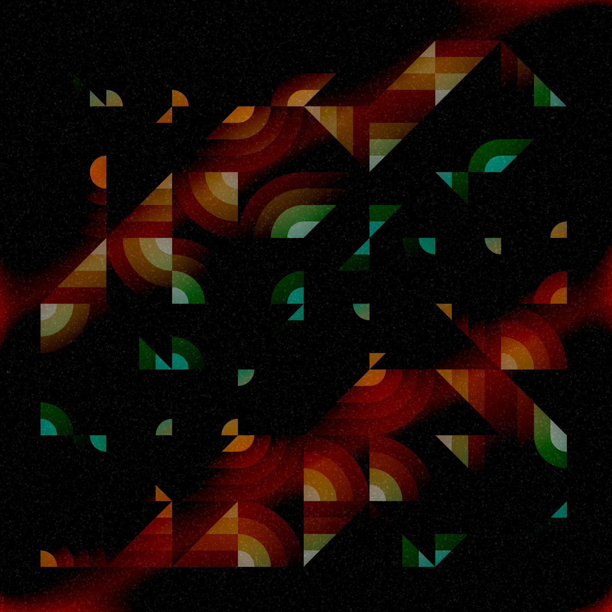

# week8
This is an analysis made for the subsequent creation of a new artwork

# Part1: Imaging Technique inspiration

[Artwork Link](https://openprocessing.org/sketch/1247971)

## Inspiration introduction

- This artwork uses different geometric shapes such as circles, rectangles and trapezoids to create an artistic effect through overlapping and shadows. However, if you click on the link and refresh, you will realise that it is a dynamic and **interactive digital artwork**, with a new design appearing with each refresh. 
- For a subsequent group assignment, I considered adding this type of interaction to our work. That is, a brand new piece appears each time you click., At the same time, this design could make our project more **interactive** by clicking through, thus increasing the user's **attraction** to the artwork.

## Example display

